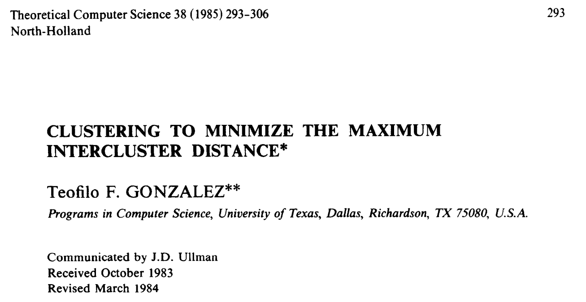
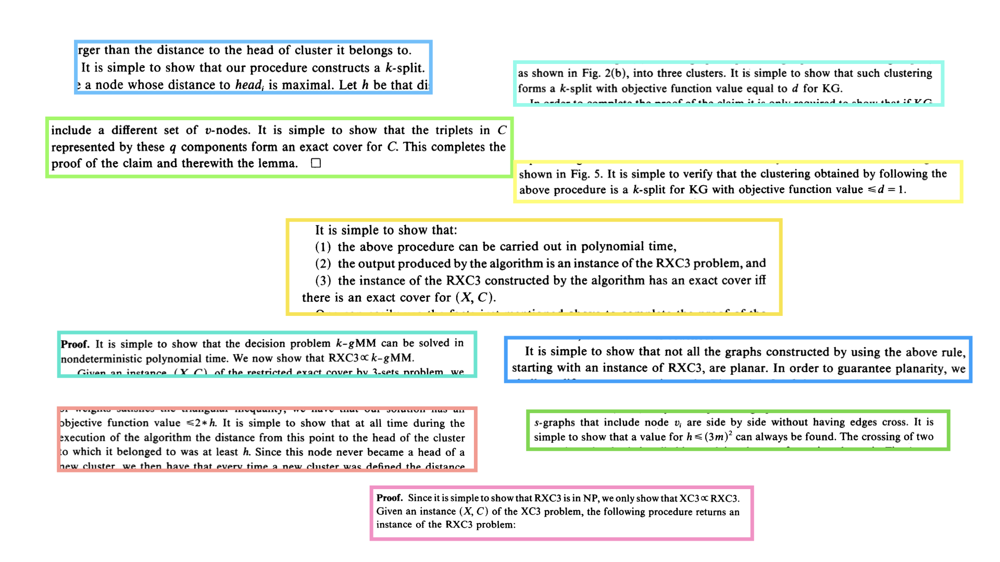
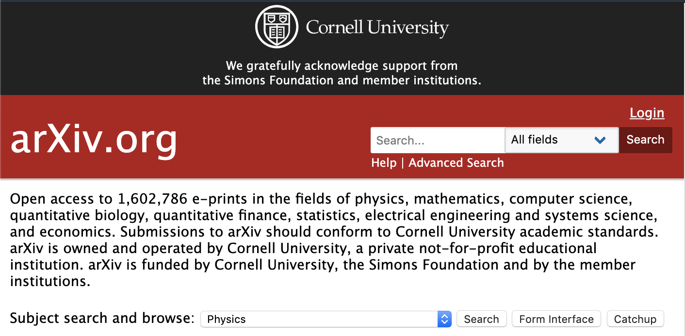
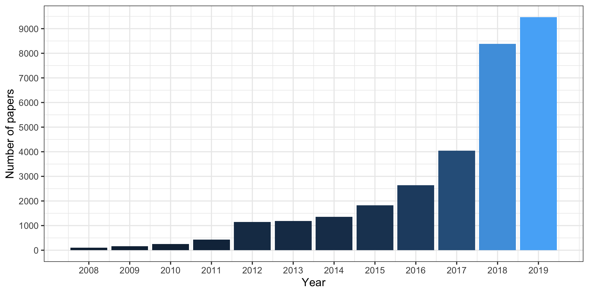

```{r setup, include=FALSE}
knitr::opts_chunk$set(echo = FALSE)
library(tidyverse)
library(gganimate)
library(viridis)
library(stringr)
library(shiny)
```

<script src="https://ajax.googleapis.com/ajax/libs/jquery/1.12.2/jquery.min.js"></script>

<script>
    $(document).ready(function() {
      $('slide:not(.title-slide, .backdrop, .segue)').append('<footer label=\"www.github.com/andrewcparnell/data_beers\"></footer>');    
    })
</script>

<style>
  footer:after {
    content: attr(label);
    font-size: 12pt;
    position: absolute;
    bottom: 20px;
    left: 100px;
    line-height: 1.9;
  }
</style>

## An important paper

```{r, out.width='100%', fig.align='center', out.extra='style="background-color: #000000; padding:5px; display: inline-block;"'}

```

## It is simple to show that...

```{r, out.width='100%', fig.align='center'}

```

## arXiv

```{r, out.width='100%', fig.align='center'}

```

## stat.ML papers by year

```{r, out.width='100%', fig.align='center'}

```

## Domination

```{r, out.width='100%', fig.align='center'}
library(wordcloud2)
suppressPackageStartupMessages(library(viridis))
set.seed(123)
words_filt = readRDS(file = 'all_statml_words.rds') %>% 
  filter(word != 'learning')
wordcloud2(words_filt,
             color=rep_len(viridis(10), nrow(words_filt)),
             fontFamily = 'Helvetica')
```

<!--
## Changing word popularity over 12 years

```{r, eval = FALSE}
words2 = readRDS(file = 'words2.rds')
my_font = "Helvetica"
bar_plot = ggplot(words2, aes(ordering, group = word)) +
  geom_tile(aes(y = norm_freq / 2, 
                height = norm_freq,
                width = 0.9,
                fill =norm_freq), alpha = 0.9) +
  geom_text(aes(y = 0, label = word), 
            family= my_font, size = 5, #nudge_y = -5, 
            colour = 'white',hjust = 0) +
  geom_text(aes(x=1.1,y=200, label=paste0(year)),
            family=my_font, size=8, color = 'gray45') +
  #coord_cartesian(clip = "off", expand = FALSE) +
  coord_flip(clip = "off", expand = FALSE) +
  labs(#title = 'Top 10 stat.ML terms by year',
       #subtitle = 'frequency normalised',
       caption = 'based on plot by @emilykuehler',
       x = '',
       y = 'Normalised frequency by year') +
  theme(legend.position = 'None',
        axis.title.y=element_blank(),
        axis.text.y=element_blank(),
        axis.ticks.y=element_blank()) +
  transition_time(year) +
  ease_aes('cubic-in-out', interval = 0.01)
```
```{r, interval = 30/60, out.width='100%', fig.align='center'}
# animate(bar_plot, fps = 8, detail = 3)
```
-->

## Word cloud by year

```{r, out.width='70%', fig.align='center'}
set.seed(123)
ui <- bootstrapPage(
  wordcloud2Output('wordcloud2'),
  sliderInput('choose_year', label = 'Year',
              min = 2008, max = 2019, value = 2007, sep = "",
              step = 1, animate = animationOptions(interval = 3000))
)
server <- function(input, output) {
  words = readRDS(file = 'words_by_year_20191013.rds')
  output$wordcloud2 <- renderWordcloud2({
    words_filt = words %>%
      filter(year == input$choose_year) %>%
      rename(freq = norm_freq) %>%
      select(-year, -n)
    set.seed(123)
    wordcloud2(words_filt,
               color=rep_len(viridis(10), nrow(words_filt)),
               fontFamily = 'Helvetica')
  })
}
shinyApp(ui = ui, server = server)   
```

## Search term in title against baseline

```{r, out.width='70%', fig.align='center'}
textInputRow<-function (inputId, label, value = "") 
{
    div(style="display:inline-block",
        tags$label(label, `for` = inputId), 
        tags$input(id = inputId, type = "text", value = value,class="input-small"))
}
ui2 <- bootstrapPage(
  plotOutput('popularity'),
  textInputRow("word_choose", label = "Search term",
            value = "deep learning"),
  textInputRow("baseline_choose", label = "Baseline term",
            value = "all")
)
server2 <- function(input, output) {
  clean_scrape = readRDS(file = 'scrape_clean_20191013.rds')
  datasetInput <- reactive({
    as.character(input$word_choose)
  })
  baselineInput <- reactive({
    as.character(input$baseline_choose)
  })
  output$popularity <- renderPlot({
    if(baselineInput() == 'all') {
      baseline_dat = clean_scrape %>% count(year) %>% 
        select(year, n) %>% rename(n_baseline = n)
    } else {
      baseline_dat = clean_scrape %>%
        filter(stringr::str_detect(titles, baselineInput())) %>% 
        count(year) %>% 
        select(year, n) %>% 
        rename(n_baseline = n)
    }
    clean_scrape %>%
      filter(stringr::str_detect(titles, datasetInput())) %>% 
      count(year) %>% 
      left_join(baseline_dat) %>% 
      ggplot(aes(x = year, y = n/n_baseline)) + 
      #geom_line(aes(colour = n)) + 
      geom_smooth(se = FALSE, size = 3, colour = 'red') + 
      scale_x_continuous(breaks = scales::pretty_breaks(n = 10)) + 
      labs(x = 'Year',
           y = 'Relative number of papers',
           main = paste0('Popularity of ',datasetInput(),' over time'),
           subtitle = ifelse(baselineInput() == 'all',
                             'Relative to overall',
                             paste0('Relative to ',baselineInput()))) + 
      theme(legend.position = 'None') + 
      theme_bw()
  })
}
shinyApp(ui = ui2, server = server2)   
```

## For you...

- Everything on GitHub page
- Data set with 31,000+ papers at GitHub site
    - Includes date submitted, title, abstract, authors
- Web scraping R script
- `wordcloud2` plots
- Topic modelling script
- 2 shiny apps to play with data

<div class="centered">
<b> Thanks and enjoy! </b>
<b> [github.com/andrewcparnell/data_beers](https::/www.github.com/andrewcparnell/data_beers)

</div>


